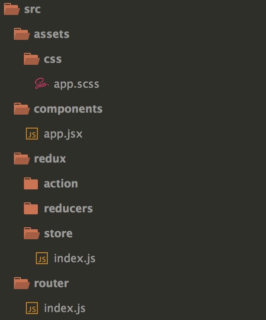

react redux react-router antd toolkit
=====================================

### Introduction

base on **react** **redux** **react-router** **antd**

build for Single Page Applications (SPA)

#### code


#### router
```
const componentsRoutes = [
	{	
		basename: '/home',
		exact: true,
		path: '/feed',
		component: Feed
	},
	{
		basename: '/home',
		path: '/test',
		component: Test
	}
]

const routes = [
	{
		title: '主页',
		key: 'home',
		iconType: 'home',
		routes: [
			{
				title: 'feed流',
				key: 'feed',
				path: '/home/feed'
			},
			{
				title: 'test',
				key: 'test',
				path: '/home/test'
			}
		]
	},
	{
		title: '用户中心',
		key: 'userCenter',
		iconType: 'user',
		routes: [
			{
				title: '个人信息',
				key: 'infomation',
				path: 'userInfo'
			}
		]
	}
]
```

#### connect with redux react-router antd
```
import React, { Component } from 'react'
import { store, history } from '../redux/store'
import { Provider } from 'react-redux'
import { ConnectedRouter } from 'react-router-redux'
import { BrowserRouter as Router, Route, Link, Redirect, NavLink } from 'react-router-dom'
import { withRouter} from 'react-router'
import { Layout, Menu, Breadcrumb, Icon } from 'antd'

import { routes, componentsRoutes } from '../router'

<Provider store={store}>
  				<ConnectedRouter history={history}>
  					<Layout>
  						<Sider
							collapsible
							collapsed={this.state.collapsed}
							onCollapse={this.onCollapse}
				        >
			          		<div className="logo"></div>
			          		<Menu theme="dark"
			          			mode={this.state.mode}
			          			onSelect={this.onSelect}
			          			onOpenChange={this.onOpenChange}
			          			openKeys={this.state.openKeys}
			          			defaultOpenKeys={this.state.defaultOpenKeys}
			          			selectedKeys={this.state.selectedKeys}
			          			defaultSelectedKeys={this.state.defaultSelectedKeys}>
			          			{routes.map(item => (
			          				<SubMenu
			          					key={item.key}
			          					title={<span><Icon type={item.iconType} /><span className="nav-text">{item.title}</span></span>}>
			          					{item.routes.map(routeItem => (
			          						<Menu.Item key={routeItem.key}><NavLink to={routeItem.path}>{routeItem.title}</NavLink></Menu.Item>
			          					))}
			          				</SubMenu>
			          			))}
			          		</Menu>
			        	</Sider>
			        	<Layout>
			        		<Header>
			        			头部
			        		</Header>
			        		<Content>
			        			<div className="spa-page">
			        				{location.pathname === '/' ? <Redirect to="/home/feed" /> : null}
			        				{componentsRoutes.map((route, index) => (
			            				<Route
			            					key={index}
			            					path={route.basename + route.path}
		            						exact={route.exact}
		            						component={route.component}
		            					/>
			            			))}
			        			</div>
			        		</Content>
			        		<Footer style={{ textAlign: 'center' }}>
			            		react-antd© 2017
			          		</Footer>
			        	</Layout>
  					</Layout>
  				</ConnectedRouter>
  			</Provider>
```